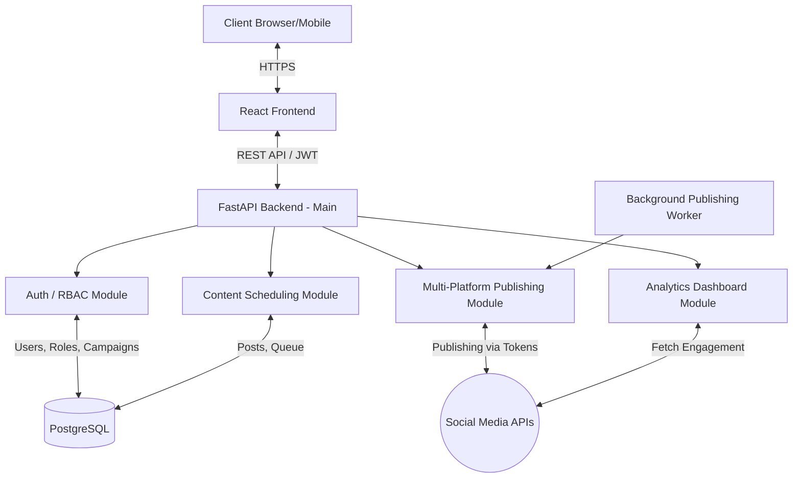

# Backend — FastAPI

FastAPI backend for the social media scheduler & campaign management platform (see root `README.md` for setup).

## 1. Architecture

## 2. Core Tables

- **users** — accounts with role (`business`, `marketing`, `creator`, `administrator`)
- **workspaces / workspace_members** — client workspaces and member assignment
- **campaigns** — campaign metadata (budget, dates, status)
- **posts** — content with status (`Draft`, `Scheduled`, `Queued`, `Published`, `Failed`, `Cancelled`)
- **social_accounts** — connected platform accounts and OAuth tokens
- **publishing_queue** — scheduled work items processed by the background worker
- **publishing_logs** — per-platform publish attempts (status, response, failure reason, platform post ID)
- **analytics tables** — audience, platform, post, and campaign analytics

## 3. API Structure

All routes are mounted under `/api/v1` and documented in Swagger at `/docs`.

| Area | Router | Highlights |
|---|---|---|
| Authentication | `/auth` | `POST /register`, `POST /login`, `GET /me`, Google OAuth |
| Users | `/users` | Profiles, settings |
| Workspaces | `/workspaces` | Client workspaces & members |
| Campaigns | `/campaigns` | CRUD + metrics |
| Posts | `/posts` | Create/schedule/update/delete posts, media upload |
| Social Accounts | `/social-accounts` | Connect/disconnect platforms, token refresh |
| Publishing | `/publishing` | Queue, logs, failed posts, platform history, retries, cancel |
| Publish | `/publish` | Immediate publish through the shared pipeline |
| Marketing | `/marketing` | Marketing dashboard stats, client workspace, team requests |
| Business | `/business` | Business dashboard, reports, activity |
| Analytics | `/analytics` | Engagement, audience, platform, post, campaign metrics |
| Notifications | `/notifications` | In-app notifications |
| Admin | `/admin` | Platform-wide admin endpoints |
| Settings | `/settings` | User settings |

## 4. Background Worker

`app/services/background_worker.py` starts an asyncio loop (via the app lifespan) that polls the **publishing queue** and publishes due posts through the shared pipeline — token validation → dispatch to platform services → logging → retries. No external scheduler is required.

## 5. Seed Data

`app/seed.py` runs automatically on startup when the `users` table is empty (and can be re-run manually — it is idempotent):

- 3 business users, 4 marketing teams, 2 creators, and **1 administrator** (`admin1@test.com`)
- Password for all seeded accounts: `password123`
- Workspaces, test campaigns, posts (draft/scheduled/published), connected demo social accounts, analytics, and publishing history

> Only **one** administrator can ever exist — registering another is rejected by the backend.
